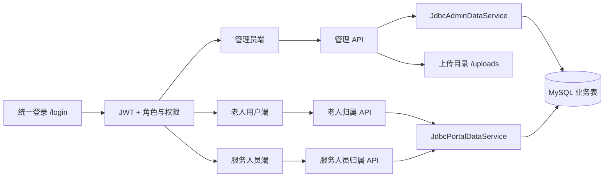
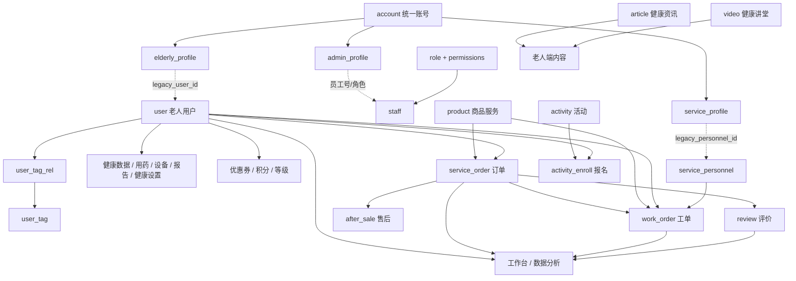

# 黛西健康项目功能完成度与模块关系审查

> 审查日期：2026-07-13
> 审查基线：`main` 分支，提交 `9091324`
> 项目定位：智慧养老教学性演示项目，不以生产商用系统为验收目标

## 1. 审查结论

当前项目已经具备一套可以进行课堂展示的“三角色、同数据、跨端联动”系统：管理员维护用户、商品服务、运营内容和工单；老人用户查看自己的资料与健康信息、报名活动并创建工单；服务人员查看分配给自己的工单并更新状态。登录、JWT、角色分流、后端数据归属校验、MySQL 初始化、文件上传以及主要演示数据均已接通。

整体判断如下：

- **核心教学主线基本完成**：统一登录、用户管理、商品服务、活动报名、工单分配及处理已经形成跨角色闭环。
- **管理端覆盖面较广，但部分模块是“通用 CRUD 展示”**：页面和接口存在不等于形成了完整业务流程，尤其是交易、审核、系统权限和数据分析。
- **老人端可读能力较完整，可写能力集中在资料、头像、设备、活动报名和创建工单**。
- **服务人员端是最小可用版本**：可以看本人资料、本人工单和修改工单状态，但还不是完整的上门服务作业端。
- **支付和线上聊天明确不在本项目范围内**：不应作为未完成功能；订单只需表达教学用业务记录及状态，不需要支付网关、退款结算或实时聊天。
- **下一阶段最值得做的不是继续堆菜单**，而是让现有控件、状态流和测试更真实，并降低大文件、通用 Map 和集中式 Service 带来的维护成本。

就教学演示而言，项目可评价为“**主流程可演示，次要模块有覆盖，真实性和可维护性仍需收口**”。

## 2. 范围和判定方法

### 2.1 本次纳入审查的内容

- 前端路由、菜单、页面、API 调用和本地降级数据。
- 后端 Controller、鉴权过滤器、权限映射、Service 和 SQL。
- 数据库表、初始化数据和主要表间逻辑关系。
- 管理员、老人用户、服务人员三个身份的数据边界。
- 自动化测试和生产构建结果。
- 现有 README、概要设计与实际代码的一致性。

### 2.2 明确不纳入完成度扣分的内容

- 第三方支付、支付回调、财务对账和真实退款。
- WebSocket、在线客服、即时聊天和消息已读状态。
- 生产级高可用、分布式部署、海量并发和微服务拆分。
- 真实硬件接入、地图定位、短信、推送和视频托管。

### 2.3 状态定义

| 状态 | 含义 |
|---|---|
| 已完成 | 页面、接口、持久化和核心交互均存在，能够支撑预期教学演示 |
| 基本完成 | 主路径可用，但有少量未接线控件、弱校验或缺少关键测试 |
| 部分完成 | 能展示或完成部分操作，但业务闭环、状态流或数据真实性不足 |
| 未接线/遗留 | 代码、表或文档中存在痕迹，但当前菜单、路由或接口没有形成可用入口 |
| 不在范围 | 根据项目定位有意不实现，不视为缺陷 |

## 3. 总体架构与模块关系

### 3.1 运行结构



前端只有一个 Vue 应用。登录后根据 `roleType` 分流：

- `staff`：进入管理端，并按 `role.permissions` 控制菜单和接口动作。
- `elderly`：固定进入 `/portal/user`，后端通过 Token 中的 `accountId` 找到本人用户记录。
- `service`：固定进入 `/portal/service`，后端通过 Token 中的 `accountId` 找到本人服务人员记录。

### 3.2 主要业务关系



需要注意：这些关系目前主要由字段命名、查询 JOIN 和应用代码维护，`schema.sql` 没有声明数据库外键。因此图中实线/虚线表达的是业务关系，不代表数据库已经配置外键约束。

### 3.3 跨端闭环

| 闭环 | 管理端 | 老人端 | 服务人员端 | 共用数据 |
|---|---|---|---|---|
| 用户资料 | 创建、编辑、查看完整资料 | 查看、编辑本人资料和头像 | 只读本人服务资料 | `user`、`account`、各 profile 表 |
| 商品到服务 | 维护商品服务 | 选择商品和服务人员创建工单 | 查看被分配工单 | `product`、`service_order`、`work_order` |
| 工单处理 | 创建、分配、查询、编辑 | 查看本人工单 | 查看并修改本人名下工单状态 | `work_order` |
| 活动报名 | 发布活动、管理报名 | 查看活动并报名 | 无 | `activity`、`activity_enroll` |
| 健康内容 | 发布资讯和视频 | 阅读资讯、观看讲堂 | 无 | `article`、`video` |
| 健康信息 | 维护用户健康扩展数据 | 查看本人健康、用药、设备和报告 | 无 | 健康相关业务表 |

## 4. 各功能完成情况

### 4.1 基础能力

| 功能 | 状态 | 审查说明 |
|---|---|---|
| 统一登录 | 已完成 | 三类身份共用登录页，登录后按 `roleType` 分流 |
| JWT 会话恢复 | 基本完成 | 请求统一带 Bearer Token；路由守卫可重新加载资料；没有服务端 Token 撤销机制，但演示项目可接受 |
| 后端角色隔离 | 已完成 | 老人端和服务人员端均根据 Token 反查本人业务 ID，不接受前端传入身份 ID |
| 管理端 RBAC | 基本完成 | 前后端都有模块级查看/编辑/删除判断；角色页面不能可视化编辑权限矩阵 |
| 文件上传 | 已完成 | 支持图片和报告类文件，包含目录、扩展名、大小和内容检查，并有 5 项后端上传测试 |
| 统一响应与异常 | 基本完成 | 使用 `ApiResponse` 和全局异常处理；部分业务错误仍以 HTTP 200 + 业务码返回 |
| Mock 演示模式 | 基本完成 | 提供 `mock` profile，但主文档和主要验证路径以 MySQL 为主 |
| 移动端适配 | 基本完成 | 老人端、服务人员端和管理端有响应式处理；缺少浏览器端自动化回归 |

### 4.2 管理端

| 模块 | 状态 | 已有能力 | 主要不足 |
|---|---|---|---|
| 工作台 | 基本完成 | 用户、工单、订单、标签、服务占比和趋势读取真实表 | 指标涨跌百分比是固定演示值；“New posts”中英混用 |
| 预约看板 | 部分完成 | 以工单为预约数据源，可新增、编辑、删除并按商品筛选 | 后端只返回当天工单；页面日期选择器没有参与查询，切换日期不生效 |
| 用户列表 | 基本完成 | 用户 CRUD、头像、标签绑定和标签管理；关键词查询有效 | 创建日期筛选未接后端；标签是前端本页过滤，分页扩展后会不准确 |
| 用户详情 | 基本完成 | 完整资料以及用药、健康、设备、报告、订单、资产、内容、服务记录 | 单文件承担过多资源；不同 Tab 的校验和错误提示不够一致 |
| 用户扩展 | 基本完成 | 设备、报告、健康设置、优惠券、积分、等级、积分规则 CRUD | 很多资源共用通用 Map 和通用页面，业务约束较弱 |
| 服务人员 | 基本完成 | 人员新增、编辑、删除、状态和区域管理 | 人员账号/profile 同步关系缺少端到端验证 |
| 审核管理 | 部分完成 | 可通过通用编辑更新审核状态 | `/approve`、`/reject` 动作接口当前只写“已接收”日志，不改变审核状态 |
| 工单管理 | 基本完成 | 创建时选择客户、商品和服务人员；按人员/客户查询；编辑状态 | 独立的开始、完成、取消、重新分配动作接口只记录日志；状态转换规则未集中约束 |
| 商品服务 | 已完成 | 商品/服务统一维护，价格、类型、分类、时长和状态可编辑 | 旧的商品分类、服务项目扩展能力处于遗留未接线状态 |
| 运营管理 | 基本完成 | 动态、话题、轮播、活动、报名、食谱、资讯、疾病、机构、视频、食物、测评均有 CRUD | 除活动、资讯、视频外，多数模块只在管理端自循环，属于内容管理演示 |
| 订单管理 | 部分完成 | 订单记录 CRUD 和状态编辑 | 关闭/派单动作接口只记录日志；没有严谨订单状态机；支付不在范围内 |
| 售后管理 | 部分完成 | 售后记录 CRUD 和状态字段 | 通过/驳回动作接口只记录日志；无退款属于项目边界，不扣分 |
| 评价管理 | 部分完成 | 评价记录 CRUD、评分和可见状态展示 | 回复/隐藏动作接口只记录日志，老人端也没有发起评价入口 |
| 数据分析 | 部分完成 | 顶部四项指标读取真实数据库 | 三张 ECharts 图是固定演示数据；日期范围选择器不影响请求和结果 |
| 员工管理 | 基本完成 | 员工 CRUD、角色分配、账号资料同步 | 角色选择依赖通用表单，缺少账号生命周期和重置密码的清晰交互 |
| 角色管理 | 部分完成 | 角色名称和描述 CRUD，后端支持 `permissions` 字段 | 页面没有权限矩阵或 permissions 编辑项，新建角色默认 `{}`，无法直接配置可用权限 |
| 操作日志 | 部分完成 | 业务写操作会增加日志，管理端可查看 | 操作人和 IP 多为固定“系统管理员/127.0.0.1”，不是真实审计 |
| 顶部全局搜索/通知 | 已移除 | 教学演示项目不建设全局搜索和通知中心 | 已删除无效输入框和按钮，避免造成可用性误判 |

### 4.3 老人用户端

| 功能 | 状态 | 审查说明 |
|---|---|---|
| 本人资料与头像 | 已完成 | 可查看和修改较完整的个人、生活习惯和紧急联系人资料，变更同步统一账号 |
| 健康数据 | 基本完成 | 可查看健康记录及趋势图；不能自行新增测量记录 |
| 用药记录 | 部分完成 | 可查看本人用药；没有用药打卡、提醒确认或自助维护 |
| 设备与报告 | 基本完成 | 可查看本人设备和报告，可编辑本人设备且 SQL 带用户归属条件 |
| 订单、优惠券和积分 | 基本完成 | 只读本人数据，满足演示；无消费、兑换和积分规则触发闭环 |
| 社区活动 | 基本完成 | 可查看活动详情、历史、可报名活动并报名，容量校验使用真实报名数 | 没有用户主动取消报名入口 |
| 健康资讯 | 已完成 | 读取管理端发布的 `article` 数据并展示详情 |
| 健康讲堂 | 已完成 | 读取管理端发布的 `video` 数据并打开视频地址 |
| 商品服务 | 已完成 | 展示上架商品服务，可选择服务人员和时间创建工单 |
| 我的工单 | 基本完成 | 可查看本人创建/关联工单和分配人员 | 不能改期、取消、申请售后或评价；这些可作为可选教学扩展 |

### 4.4 服务人员端

| 功能 | 状态 | 审查说明 |
|---|---|---|
| 本人资料 | 基本完成 | 可查看姓名、电话、头像、服务类型、区域、入职时间、审核状态和评分 |
| 本人工单列表 | 已完成 | 查询条件固定为 Token 对应的 `personnel_id`，不会返回他人工单 |
| 工单详情 | 已完成 | 详情查询同样带人员归属条件 |
| 工单状态更新 | 基本完成 | 支持待服务、服务中、完成、取消；完成时写完成时间 | 任意状态之间都可直接跳转，缺少状态机和原因校验 |
| 服务过程记录 | 部分完成 | 当前只有状态字段 | 没有过程文本、图片/附件、异常上报和取消原因交互 |
| 签到与排班 | 未接线/遗留 | 无实际入口 | 定位、签到、排班日历不是当前核心闭环，可按教学需要选做 |
| 收入、评价明细、通知 | 未接线/遗留 | 无实际入口 | 可不做，避免扩大演示项目范围 |

## 5. 已完成的关键业务闭环

### 5.1 管理端发布活动，老人端报名

1. 管理员维护 `activity`。
2. 老人端只读取已发布/已结束或本人有报名记录的活动。
3. 报名写入 `activity_enroll`，身份来自 Token。
4. 容量检查在事务中锁定活动，并按每个用户的最新有效报名记录计算人数。
5. 管理端和老人端都读取真实报名数，`activity.enrolled` 只是兼容回写字段。

这是当前实现质量最高的跨端流程之一，已有后端与前端回归测试支撑。

### 5.2 老人选择商品和服务人员，服务人员处理工单

1. 管理员维护上架的 `product` 和可服务人员。
2. 老人端只展示上架商品，以及启用且审核通过的服务人员。
3. 老人创建业务订单 `service_order`，同时创建 `work_order`。
4. 管理端可按客户或人员查到该工单。
5. 指定服务人员只看到分配给自己的工单，并更新状态。

该闭环已可演示，但老人端创建订单和工单的方法当前没有事务注解。如果第一条插入成功、第二条插入失败，会残留没有工单的订单，应优先补上事务保护。

### 5.3 管理端与老人端资料同步

- `account` 负责统一登录身份。
- `elderly_profile` 将统一账号映射到旧业务 `user`。
- 管理端和老人端修改资料后都会同步镜像字段。
- 老人端更新设备时同时校验设备 ID 和当前用户 ID。

该设计满足演示需要，但双份资料字段增加了同步成本；以后应明确哪张表是主数据源。

## 6. 代码中存在但未形成当前功能的部分

### 6.1 商品分类和服务项目

前端 `http.js`、`GenericListView.vue` 以及后端资源映射函数中仍有 `productCategories` 和 `serviceItems`，数据库也有对应表；但是：

- 当前菜单只保留统一“商品服务管理”。
- `/product-ext/:resource` 会重定向到 `/products`。
- `PhaseResourceController` 的 GET/POST/PUT/DELETE 映射数组没有包含 `/product-categories` 和 `/service-items`。
- README 仍把这两组接口写成已提供接口。

因此应标记为“遗留未接线”。建议二选一：删除遗留配置和文档，或完整恢复 Controller 与页面入口。对当前演示定位而言，保留统一商品页、清理遗留代码更简单。

### 6.2 消息接口

`/api/v1/messages` 实际复用了 `posts` 数据：查询返回动态，创建写动态，更新也只更新动态，删除甚至只记录操作已接收。它不是在线聊天功能。

由于本项目明确不做线上聊天，建议删除这组误导性接口，或改名为明确的站内公告/动态接口；不要继续扩展为聊天系统。

### 6.3 协议、积分记录和测评结果

这些资源在表、API 或通用页面配置中有不同程度支持，但没有出现在当前主菜单。它们可以作为后续教学扩展，但不应在“已完成菜单模块”中重复计算完成度。

## 7. 主要问题与风险

### 7.1 P0：界面真实性问题（已于 2026-07-13 完成）

审查时发现以下控件只有外观、没有驱动查询：

- 顶部全局搜索和通知按钮。
- 预约看板日期选择器。
- 数据分析日期范围选择器。
- 通用列表的状态、日期和关键词筛选（工单的人员/客户筛选除外）。
- 用户列表的创建日期筛选。

完成情况：预约日期、分析日期、用户和通用列表筛选已经接入真实查询；预约看板保留连续 7 天数据库数据。全局搜索、通知和消息因不属于教学主线已移除。

### 7.2 P0：静态降级数据掩盖后端故障（已于 2026-07-13 完成）

原先 `DashboardView.vue`、`UsersView.vue` 和 `GenericListView.vue` 在请求失败后会自动显示静态 fallback 数据，容易误判系统状态。

完成方式：

- 工作台、用户列表、通用列表和预约看板请求失败后清空数据并显示明确错误。
- 删除未使用的 `src/api/fallback.js`，普通 MySQL 模式不再静默切换数据来源。
- 保留后端 `mock` profile 作为明确启动的演示模式，而不是请求失败后的隐式兜底。

### 7.3 P0：老人端创建订单与工单缺少原子事务（已于 2026-07-13 完成）

`JdbcPortalDataService.createElderlyWorkOrder` 已增加 `READ_COMMITTED` 事务；创建 `service_order` 或 `work_order` 任一步失败都会整体回滚，避免半成品订单。

### 7.4 P1：业务逻辑过度集中

- `JdbcAdminDataService.java` 约 1555 行，承载认证、用户、商品、工单、运营、交易、系统和分析。
- `UserPortalView.vue` 约 1072 行，包含十余种数据、多个弹窗和全部老人端交互。
- `GenericListView.vue` 约 668 行，同时维护资源标题、列、表单、数据加载和保存规则。

一个字段变化可能同时修改 Controller、Service 的资源名分支、SQL、前端资源路径、列配置和表单配置，容易漏接。

建议按领域拆分，而不是按“每张表一个类”机械拆分：

```text
identity        账号、角色、权限、资料镜像
elder-care      老人资料、健康、设备、报告、用药
service         服务人员、商品服务、订单、工单
community       活动、报名、资讯、视频和其他运营内容
administration  员工、日志、协议、统计
```

### 7.5 P1：通用 Map 和弱校验

Controller 和 Service 广泛使用 `Map<String, Object>`，很多必填、枚举、数值和状态校验依靠字符串分支。优点是开发快，缺点是字段拼写错误只能在运行期暴露。

优先为以下写操作增加请求 DTO 和 Bean Validation：

- 登录和修改密码。
- 新建用户、修改用户资料。
- 创建工单和更新工单状态。
- 活动创建和报名。
- 员工、角色和权限修改。

### 7.6 P1：状态动作接口名义完成、实际只写日志

审核通过/驳回、工单开始/完成/取消/改派、订单关闭/派单、售后通过/驳回、评价回复/隐藏等专用动作接口中，有多组只是调用 `accepted(...)` 写日志，并不更新目标数据。

当前页面多数通过通用 `PUT /{resource}/{id}` 绕过了这些接口，因此基础演示仍能工作；但 API 语义和行为不一致。应删除占位动作接口，或让它们执行真实状态转换并加测试。

### 7.7 P1：状态机和数据约束不足

- 服务人员可从任意工单状态直接跳到任意允许枚举。
- 订单、售后和审核缺少集中状态转换规则。
- 数据库没有外键，删除父记录可能留下孤儿数据。
- 老人资料同时保存在 `user`、`account`、`elderly_profile`，靠代码同步。

教学项目不必引入复杂工作流引擎，但应至少用一个状态转换函数和少量数据库约束表达业务规则。

### 7.8 P1：权限管理只完成了执行端

权限读取、前端菜单隐藏和后端动作鉴权已经存在，但角色页面没有 permissions 可视化编辑。新建角色默认权限为 `{}`，普通管理员无法在界面完成“创建角色—分配权限—分配员工”的完整闭环。

建议增加一个简单的模块 × 动作复选框矩阵，仅支持 `view/edit/delete` 即可，不需要复杂组织架构。

### 7.9 P1：分析图表和审计数据不够真实

- 数据分析的顶部指标是真实统计，三张图是硬编码数据。
- 工作台和分析页的涨跌百分比是固定文案。
- 操作日志中的操作人和 IP 多为固定值。

对教学演示，推荐让图表基于少量真实 SQL 聚合，不必引入数仓或实时计算。

### 7.10 P2：测试与构建质量

本次实测结果：

```text
后端：37 项测试通过
前端：11 项测试通过
前端：生产构建通过
```

现有测试较好地覆盖了 JWT、上传、老人端 Controller、活动报名计数、工单归属和若干 SQL 契约。但仍缺少：

- 三种角色从登录到关键业务操作的端到端测试。
- 权限拒绝的完整接口矩阵测试。
- 管理端主要 CRUD Controller 测试。
- 真实 MySQL 下的迁移、约束和事务回滚测试。
- 浏览器端交互与移动端回归。

构建产物中主 JS 约 2.42 MB（gzip 后约 784 KB），Vite 提示大 chunk。对局域网演示不构成阻塞，但可通过路由懒加载和 ECharts/Element Plus 分包优化。

## 8. 推荐改进顺序

### 第一阶段：让演示结果可信

1. **已完成**：给老人创建订单/工单增加事务，消除跨表半成功风险。
2. **已完成**：移除不在教学演示范围内的全局搜索和通知，并接通日期与关键词筛选。
3. **已完成**：请求失败时取消静默 fallback，改为明确错误态和重试入口。
4. 修正文档中的商品分类/服务项目接口，并删除或接通遗留代码。
5. 删除或重命名 `/messages`，明确系统不提供在线聊天。
6. 为管理员、老人、服务人员各增加一条最短端到端冒烟用例。

### 第二阶段：补齐现有业务闭环

1. 增加角色权限矩阵，完成角色—权限—员工分配闭环。
2. 为工单实现简单状态机：待服务 → 服务中 → 已完成；任何进行中状态可取消并要求原因。
3. 让审核、工单、订单、售后专用动作接口真正修改状态，或删除这些接口。
4. 老人端增加取消活动报名、取消/改期工单、提交评价中的一至两个教学操作。
5. 服务人员端增加服务记录文本和异常原因；图片、定位可继续不做。
6. 将分析图表和日志身份改为真实数据。

### 第三阶段：降低后续修改成本

1. 按领域拆分 `JdbcAdminDataService` 和 `UserPortalView`。
2. 将通用资源的“路径、标题、字段、表名、权限模块”集中为单一注册表，减少多处字符串映射。
3. 为关键写接口引入 DTO、枚举和 Bean Validation。
4. 使用 Flyway/Liquibase 或至少版本化 SQL，替代启动时不断堆叠动态 `ALTER`。
5. 为关键关系增加外键或显式的删除保护。
6. 前端路由懒加载，拆分 ECharts 和 Element Plus 体积。

## 9. 建议保留的项目边界

为保持教学项目聚焦，建议明确写入后续需求说明：

### 应保留

- 三角色统一登录和权限隔离。
- 用户资料、健康信息、活动、内容、商品服务和工单主线。
- 订单、售后、评价作为后台业务记录和状态演示。
- 图片/报告上传、基础统计和操作日志。

### 不建议扩展

- 真实支付、退款通道、账单对账和发票。
- 在线聊天、WebSocket、客服坐席和消息漫游。
- Redis 会话、消息队列、搜索引擎和微服务，除非课程明确要求。
- GPS 防作弊、真实设备协议和复杂排班优化。
- 完整会员营销、优惠券核销和积分商城。

## 10. 后续每次迭代的验收清单

### 10.1 基础验收

- [ ] 后端测试全部通过。
- [ ] 前端测试和生产构建通过。
- [ ] MySQL 初始化在空库和已有库都能成功。
- [ ] 三类账号能登录并跳转到正确工作台。
- [ ] 老人和服务人员无法访问管理 API。
- [ ] 普通员工无法访问未授权模块和动作。
- [ ] 接口失败时页面不会冒充真实数据成功加载。

### 10.2 主业务演示验收

- [ ] 管理员创建用户，老人账号能读取对应资料。
- [ ] 管理员发布活动，老人端可见并报名，管理端人数同步。
- [ ] 管理员上架商品服务并启用服务人员。
- [ ] 老人选择商品和人员创建工单。
- [ ] 管理端能按用户/人员找到工单。
- [ ] 指定服务人员能看到工单，其他服务人员看不到。
- [ ] 服务人员开始并完成工单，管理端和老人端状态同步。
- [ ] 管理端发布资讯/视频后，老人端可见。
- [ ] 管理端和老人端修改资料后能看到一致结果。

### 10.3 不需要验收

- [ ] 不要求支付成功或退款到账。
- [ ] 不要求在线聊天、消息已读或实时推送。
- [ ] 不要求生产级并发、容灾和多节点部署。

## 11. 关键代码位置

| 主题 | 位置 |
|---|---|
| 前端路由和身份分流 | `daisy-health-admin-frontend/src/router/index.js` |
| 登录状态和权限缓存 | `daisy-health-admin-frontend/src/stores/auth.js` |
| 管理端菜单和布局 | `daisy-health-admin-frontend/src/layout/AdminLayout.vue` |
| 通用 CRUD 页面 | `daisy-health-admin-frontend/src/views/GenericListView.vue` |
| 老人用户端 | `daisy-health-admin-frontend/src/views/UserPortalView.vue` |
| 服务人员端 | `daisy-health-admin-frontend/src/views/ServicePortalView.vue` |
| 前端 API | `daisy-health-admin-frontend/src/api/http.js` |
| JWT 过滤和权限映射 | `daisy-health-admin-backend/src/main/java/com/daisy/health/common/JwtAuthFilter.java`、`PermissionService.java` |
| 管理端核心数据服务 | `daisy-health-admin-backend/src/main/java/com/daisy/health/service/JdbcAdminDataService.java` |
| 老人/服务人员数据服务 | `daisy-health-admin-backend/src/main/java/com/daisy/health/service/JdbcPortalDataService.java` |
| 数据结构和初始化 | `daisy-health-admin-backend/src/main/resources/schema.sql`、`data.sql` |
| 运行配置 | `daisy-health-admin-backend/src/main/resources/application.yml` |

## 12. 最终建议

后续迭代应围绕“**可信演示、完整闭环、容易讲清楚**”展开。最合适的目标不是把它扩成商业养老平台，而是让学生或评审能够清楚看到：身份如何隔离、数据如何跨端同步、活动报名如何保证容量、工单如何从创建流转到完成、统计如何从业务数据产生。

支付和线上聊天可以明确不做；相反，应优先修复无效筛选、静态图表、占位动作接口、事务缺口和权限配置入口。完成这些收口后，项目的教学价值会明显高于继续增加更多只具备通用 CRUD 的菜单。
